# 🧠 AI Self-Healing Playwright Framework - Explained

## The Problem Statement

### Traditional Test Automation Pain Point

Imagine you have a test that clicks a login button:

```typescript
// Your test
await page.click('#login-btn');  // Works today ✅
```

Tomorrow, a developer changes the HTML:

```html
<!-- Before -->
<button id="login-btn">Login</button>

<!-- After (developer renamed the ID) -->
<button id="submit-login">Login</button>
```

Now your test **breaks** ❌ because `#login-btn` no longer exists!

### In Large Teams:
- Developers change UI elements constantly
- QA tests break → CI/CD pipelines fail
- QA spends 30-50% of time just **fixing broken locators**
- Tests become "flaky" and lose trust

---

## The Solution: AI Self-Healing

Instead of tests failing, the framework **automatically fixes itself at runtime** using AI!

---

## High-Level Flow (Simple)

```
Test runs → Locator fails → AI looks at the page → Finds new selector → Test continues ✅
```

---

## Low-Level Flow (Detailed)

```mermaid
flowchart TD
    A[Test Step: Click Login Button] --> B[Try Primary Selector: #login-btn]
    B --> C{Element Found?}
    C -->|Yes| D[Execute Action ✅]
    C -->|No| E[Try Fallback Selectors]
    E --> F{Any Fallback Works?}
    F -->|Yes| D
    F -->|No| G[🧠 AI Healing Engine Activates]
    G --> H[Capture DOM Snapshot]
    H --> I[Send to LLM with Context]
    I --> J[LLM Returns Alternative Selectors]
    J --> K[Validate Each Selector in Browser]
    K --> L{Selector Valid?}
    L -->|Yes| M[Update Locator JSON File]
    M --> D
    L -->|No| N[Test Fails After Max Retries ❌]
```



---

## Concrete Example

### Step 1: Locator File (`login.locators.json`)

```json
{
    "loginButton": {
        "primary": "#login-btn",        // Main selector
        "fallbacks": [
            "button:has-text('Login')",  // Backup 1
            "[data-testid='login-button']", // Backup 2
            "button[type='submit']"      // Backup 3
        ]
    }
}
```

### Step 2: Test Code (Clean, No Locators!)

```typescript
// test/login.spec.ts
await loginPage.clickLoginButton();  // Developer writes clean code
```

### Step 3: Page Object (Uses Smart Actions)

```typescript
// pages/LoginPage.ts
async clickLoginButton() {
    await this.smartClick('loginButton');  // Uses healing engine internally
}
```

### Step 4: When Selector Breaks

1. **Primary fails:** `#login-btn` → Not found ❌

2. **Try fallbacks:**
   - `button:has-text('Login')` → Not found ❌
   - `[data-testid='login-button']` → Not found ❌
   - `button[type='submit']` → Not found ❌

3. **AI takes over:**
   - Captures the entire page HTML
   - Sends to GPT-4: *"Find me the login button in this HTML"*

4. **LLM responds:**
   ```json
   {
     "selectors": [
       { "selector": "#submit-login", "confidence": 0.95 },
       { "selector": "button.login-action", "confidence": 0.80 }
     ]
   }
   ```

5. **Validates:** Tests `#submit-login` in browser → Works! ✅

6. **Auto-updates file:** Saves new selector to JSON

7. **Continues test:** Button is clicked successfully!

---

## Key Components

| Component | Purpose |
|-----------|---------|
| `HealingEngine.ts` | Main orchestrator - coordinates the healing process |
| `LLMClient.ts` | Talks to OpenAI/Azure/Ollama |
| `LocatorAnalyzer.ts` | Analyzes why a selector failed |
| `HealingStrategy.ts` | Validates proposed selectors in browser |
| `login.locators.json` | Stores primary + fallback selectors |
| `BasePage.ts` | Page object with `smartClick()`, `smartFill()` methods |

---

## Why This is Powerful

| Traditional Approach | Self-Healing Approach |
|---------------------|----------------------|
| Test fails → QA manually fixes | Test heals itself automatically |
| Days of maintenance work | Zero maintenance (in most cases) |
| CI/CD blocked | CI/CD keeps running |
| 1 broken test = team blocked | AI fixes it in seconds |

---

## Summary

**Problem:** UI changes → Tests break → Developers blocked

**Solution:** AI watches the page, understands context, and automatically finds new selectors when old ones fail.

**Result:** Tests that repair themselves = less maintenance, more stable CI/CD, happier teams! 🎉
